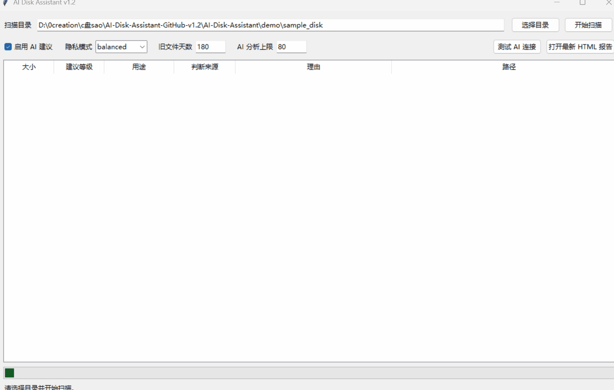
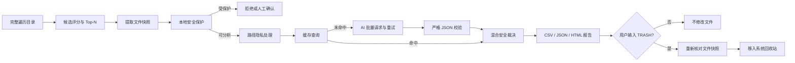

# AI Disk Assistant

> 面向 Windows 的安全型磁盘分析助手：完整扫描目录后筛选高价值候选，由本地规则保护敏感文件，再让 AI 对**脱敏后的文件元数据**提供批量、可解释建议。

本项目由个人 C 盘扫描脚本重构而来。重点不是“让 AI 自动删文件”，而是展示如何把大语言模型放入一个具备隐私、缓存、重试、结构校验、失败降级和人工确认的工程流程中。



## v1.2.1 核心亮点

- **安全混合决策**：本地保护规则优先，AI 不能越过系统目录、程序文件、用户文档、代码和备份保护层。
- **全量扫描 Top-N**：不再命中候选上限后提前退出，而是完整遍历并保留综合评分最高的候选。
- **双 API 协议**：同时支持较新的 `POST /v1/responses` 和兼容性更广的 `POST /v1/chat/completions`。
- **AI 批量分析**：一次请求分析多条元数据，支持 SQLite 缓存、429/5xx 重试、指数退避和失败批次拆分。
- **三级隐私模式**：`strict` 不发送路径，`balanced` 脱敏用户名，`full` 仅在用户主动选择时发送原路径。
- **严格结构校验**：AI 的布尔值、用途、建议等级、理由和结果数量均需符合约束，否则安全降级。
- **清理前状态复核**：移动回收站前重新检查大小、修改时间、设备号和文件标识，防止扫描后文件被替换。
- **可视化与审计**：提供 Tkinter 桌面界面、AI 连接测试按钮、CSV/JSON 明细、HTML 数据摘要和规则/AI/混合方案评测脚本。
- **工程化交付**：24 项单元测试，当前覆盖率超过 80%，GitHub Actions 同时测试 Windows/Linux 并自动构建 Windows EXE。

## 技术架构



## 目录结构

```text
AI-Disk-Assistant/
├── ai_disk_assistant/
│   ├── ai_advisor.py      # 双 API 协议、批量 AI、缓存、重试、结构校验
│   ├── cache.py           # SQLite 建议缓存
│   ├── cleaner.py         # 状态复核与回收站操作
│   ├── cli.py             # 命令行入口
│   ├── config.py          # 环境变量配置
│   ├── gui.py             # Tkinter 桌面界面
│   ├── metadata.py        # 文件元数据和快照
│   ├── privacy.py         # 三级路径隐私模式
│   ├── report.py          # CSV / JSON / HTML 报告
│   ├── safety.py          # 本地安全规则
│   └── scanner.py         # 完整遍历、候选评分与 Top-N
├── evaluation/
│   ├── benchmark.jsonl    # 40 条人工标注的模拟元数据
│   └── run_benchmark.py   # 本地规则 / 纯 AI / 安全混合对比
├── demo/                  # 可复现演示文件
├── docs/                  # 架构、简历、面试与 GIF 录制指南
├── tools/                 # AI 接口连接诊断
├── tests/                 # 单元测试
├── .github/workflows/     # CI 与 Windows Release
├── gui.py                 # GUI 快捷入口
└── main.py                # CLI 快捷入口
```

## 快速开始

### 1. 安装

最省事的方法是双击：

```text
setup_windows.bat
```

完整的手动安装、虚拟环境和 AI 配置说明见 [`docs/SETUP_GUIDE.md`](docs/SETUP_GUIDE.md)。

手动安装：

```powershell
py -3 -m venv .venv
Set-ExecutionPolicy -Scope Process -ExecutionPolicy Bypass
& .\.venv\Scripts\Activate.ps1
python -m pip install -r requirements.txt
```

不想激活虚拟环境时也可以直接使用：

```powershell
.\.venv\Scripts\python.exe -m pip install -r requirements.txt
.\.venv\Scripts\python.exe gui.py
```

### 2. 配置 AI（可选）

```powershell
Copy-Item .env.example .env
notepad .env
```

```env
AI_API_KEY=你的密钥
AI_BASE_URL=https://服务商地址/v1
AI_MODEL=服务支持的模型名
AI_API_STYLE=responses
AI_TIMEOUT=60
AI_BATCH_SIZE=12
AI_MAX_RETRIES=3
AI_CACHE_PATH=.cache/ai_advice.sqlite3
AI_PRIVACY_MODE=balanced
```

未配置密钥时仍可使用本地规则运行。

协议选择：

```env
# 服务商文档写的是 wire_api = "responses" 或 POST /v1/responses
AI_API_STYLE=responses

# 服务商要求 POST /v1/chat/completions
AI_API_STYLE=chat_completions
```

`AI_BASE_URL` 只填写到 `/v1`，程序会根据协议自动拼接 `/responses` 或 `/chat/completions`。

配置后可在 GUI 点击 **测试 AI 连接**，也可以运行：

```powershell
python tools\test_ai_connection.py
```

测试会验证密钥、模型、协议和结构化 JSON 返回，不会打印密钥内容。

### 3. 启动桌面界面

双击：

```text
launch_gui.bat
```

或运行：

```powershell
python gui.py
```

桌面界面支持选择目录、切换 AI、选择隐私模式、测试 AI 连接、查看候选列表，并自动生成 HTML 可视化报告。

### 4. 命令行扫描

```powershell
python main.py scan "$env:LOCALAPPDATA\Temp" `
  --output reports\temp.csv `
  --json reports\temp.json `
  --summary-json reports\temp_summary.json `
  --html reports\temp.html
```

常用参数：

```text
--old-days 180          以修改时间为主的旧文件阈值
--ai-limit 80           AI 最多分析的候选数
--max-candidates 5000   完整遍历后保留的 Top-N
--max-scan-files 0      0 表示完整遍历
--privacy balanced      strict / balanced / full
--no-ai                 只运行本地规则
--trash-auto            二次确认并复核状态后移入回收站
```

### 5. 可复现 Demo

```powershell
python demo\create_demo_files.py
python gui.py
```

也可以直接双击：

```text
demo\prepare_demo.bat
```

### 6. 运行对比评测

不配置 AI 时会先得到本地规则基线：

```powershell
python evaluation\run_benchmark.py
```

配置 AI 后，同一命令会比较：

1. `local_rules`：纯本地规则；
2. `pure_ai_advisory`：仅用于研究对比的纯 AI 建议；
3. `hybrid_safe`：生产流程使用的本地规则 + AI 安全混合方案。

重点指标是 `dangerous_false_positives`：把不该删除的文件错误判断为可删除的数量。纯 AI 评测结果不会进入清理器。

### 7. 构建 Windows EXE

双击：

```text
build_windows_exe.bat
```

或在 GitHub 的 **Actions → Windows Release** 中自动构建。EXE 应上传到 GitHub Releases，不要直接提交进源码仓库。完整说明见 [`docs/BUILD_EXE.md`](docs/BUILD_EXE.md)。

### 8. 测试

```powershell
python -m unittest discover -s tests -v
coverage run -m unittest discover -s tests -v
coverage report -m
```

## AI 的实际作用

传统规则擅长拦截已知危险类型，但难以解释陌生软件目录中的文件用途。AI 在本项目中只负责：

- 根据脱敏路径、名称、后缀、大小和时间推测用途；
- 生成结构化建议等级与简短理由；
- 补充本地规则覆盖不到的语义信息；
- 为评测提供可比较的模型输出。

最终是否进入“建议删除”仍由本地安全条件限制，AI 无法直接控制文件操作。

## 安全与隐私边界

- 不读取或上传文件正文；
- `balanced` 默认把 Windows 用户名替换为 `<USER>`；
- 系统目录、程序目录、文档、媒体、代码、数据库、压缩包等默认拦截；
- AI 返回异常、超时或字段不合法时默认人工确认；
- 不执行永久删除，不支持整个文件夹删除；
- 用户确认后仍会复核文件是否与扫描时一致；
- HTML 和 CSV 报告可能包含本地路径，公开前应进行脱敏。


