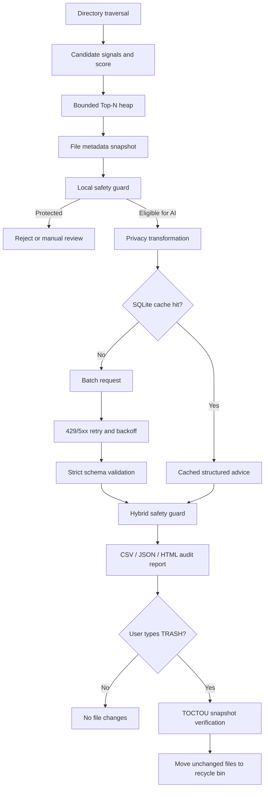

# Architecture

## Design boundaries

1. File contents are never read or uploaded.
2. The default `balanced` privacy mode masks the operating-system username before an AI request.
3. AI cannot bypass protected paths, protected suffixes or automatic-cleanup eligibility rules.
4. AI output must pass strict type, enum, count and identifier validation.
5. API failures fail closed; cached or local results never widen the deletion scope.
6. The scanner traverses the full directory and keeps a bounded Top-N heap instead of stopping at the first N matches.
7. Before a recycle-bin operation, the program verifies size, modification time, device and file identity against the scan snapshot.
8. Whole-folder and permanent deletion are intentionally disabled in the public version.
9. The pure-AI path exists only in the benchmark script and is never connected to the cleaner.
