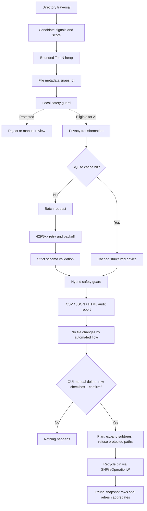

# Architecture

```mermaid
flowchart TD
    A[Directory traversal] --> B[Candidate signals and score]
    B --> C[Bounded Top-N heap]
    C --> D[File metadata snapshot]
    D --> E[Local safety guard]
    E -->|Protected| F[Reject or manual review]
    E -->|Eligible for AI| G[Privacy transformation]
    G --> H{SQLite cache hit?}
    H -->|Yes| I[Cached structured advice]
    H -->|No| J[Batch request]
    J --> K[429/5xx retry and backoff]
    K --> L[Strict schema validation]
    L --> M[Hybrid safety guard]
    I --> M
    M --> N[CSV / JSON / HTML audit report]
    N --> O[No file changes by automated flow]
    O --> P{GUI manual delete: row checkbox + confirm?}
    P -->|No| Q[Nothing happens]
    P -->|Yes| R[Plan: expand subtrees, refuse protected paths]
    R --> S[Recycle bin via SHFileOperationW]
    S --> T[Prune snapshot rows and refresh aggregates]
```

## Design boundaries

0. The **deep-analysis overview** is a display-only AI task: it consumes aggregate snapshot facts and
   returns free Markdown. It never feeds `recommend_delete`, so it is exempt from the enum validation
   that guards the per-unit decision path.
1. File contents are never read or uploaded.
2. The default `balanced` privacy mode masks the operating-system username before an AI request.
3. AI cannot bypass protected paths, protected suffixes or automatic-cleanup eligibility rules.
4. AI output must pass strict type, enum, count and identifier validation.
5. API failures fail closed; cached or local results never widen the deletion scope.
6. The scanner traverses the full directory and keeps a bounded Top-N heap instead of stopping at the first N matches.
7. The automated pipeline never touches the filesystem. The only deletion path is the GUI manual flow
   (`cleaner.py`): per-row checkbox + confirmation dialog, subtrees expanded from snapshot facts, and
   protected paths refused unconditionally.
8. Manual deletion always moves files to the recycle bin (`SHFileOperationW` + `FOF_ALLOWUNDO`),
   with system dialogs parented to the application window and `FOF_SIMPLEPROGRESS` feedback so a
   confirmation prompt can never be hidden behind the GUI. Targets that would exceed the volume's
   recycle-bin capacity (or hit a volume that does not support it) are predicted by
   `split_permanent` from the registry (`MaxCapacity` / `NukeOnDelete`) and disclosed in the app's
   own confirmation dialog; only then is `FOF_NOCONFIRMATION` set, so oversized files are never
   deleted silently. Outcomes are settled by an existence re-check. Permanent deletion stays disabled.
9. The pure-AI path exists only in the benchmark script and is never connected to the cleaner.
